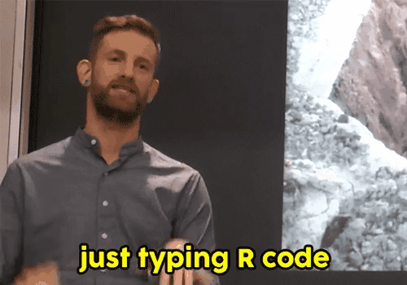

```{r message=FALSE, warning = FALSE, echo = FALSE}
knitr::opts_chunk$set(warning = FALSE, message = FALSE, fig.width = 12, fig.height = 4)
```

---
class: center, middle, inverse
## What is humanitarian data science ?

---
## Humanitarian data scientist
.center[]

---
class: center, middle, inverse
## Why humanitarian data science ?

---
## Analysis is often slow and costly (license and staff)
.center[]

---
## Analysis is often error prone and not reproducible
.center[]

---
## Lack of modern data science tools in the IMO community
.center[]

---
class: center, middle, inverse
## Grammar of data manipulation and graphics

---
class: center, middle
.center[]

---
## Why R ?

 - `R` is open source and free
 - `R` great community and around 12000 packages (add-ons)


---
## Grammar of data manipulation and graphics

```{r}
library(readxl)
data <- read_excel(path = "data/data.xlsx", sheet = 1)
data
```	


---
## Grammar of data manipulation and graphics

```{r}
data %>%
  mutate(taille_metre = taille / 100,
         imc = poids / (taille_metre^2)) %>%
  arrange(desc(imc))
```

---
class: center, middle, inverse
## Building a Massive Open Online Course

---
class: center, middle, inverse
## Demo

---
## Main activities and timeline

### Develop core [curriculum](https://docs.google.com/document/d/1ztVle5UL7TPJXh9v5amzKxRhEutRf4WqhdnCuaR7kwc/edit#)
### Organize a 1 week “sprint” session inviting core contributors (HDX, WFP, UNHCR) to build the skeleton and muscles of the core content.
### Refine content with support from DataCamp and possibly RStudio and test with large pool of IMO.
### Launch content online by end of 2018 advertise to users but also advertise so that content can be expanded/translated.


---
class: center, middle, inverse
## Questions?

<!-- [dicko5@un.org](mailto:dicko5@un.org) -->

<!-- [dickoa.gitlab.io](http://dickoa.gitlab.io) -->

